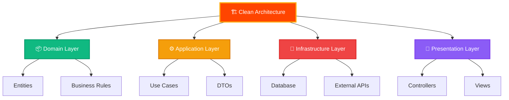

<div align="center">


</div>

<div align="center">

# 🔥 ¡Bienvenido a mi Universo de Código! 🔥


</div>

<div align="center">

[](https://git.io/typing-svg)

</div>

<div align="center">


[](https://github.com/whoysAndre)
[](https://github.com/whoysAndre)


</div>

<br>

<div align="center">
  
</div>

---

## 🎯 Sobre Mí


```typescript
const andre: Developer = {
  nombre: "André Rodrigo",
  ubicacion: "Perú 🇵🇪",
  rol: "Full Stack Developer",
  mentalidad: ["Constancia", "Disciplina", "0 Conformidad"],
  caracteristicas: {
    aprendizaje: "Autodidacta 📚",
    pasion: "Código & Lógica 💡",
    adaptabilidad: "⚡ Extremadamente Rápida",
  },
  idiomas: {
    espanol: "Nativo",
    ingles: "Intermedio 🇬🇧"
  },
  codigoEstilo: {
    arquitectura: "Clean Architecture",
    principios: ["SOLID", "DRY", "KISS"],
    testing: "TDD cuando es posible",
    documentacion: "Clara y concisa"
  },
  objetivos2025: [
    "🎯 Dominar patrones avanzados de arquitectura",
    "🌟 Contribuir a proyectos open source",
    "🚀 Construir productos escalables e innovadores",
    "🔥 Nunca dejar de aprender"
  ]
};
```

<br clear="right"/>

<div align="center">

### 💪 Mi Filosofía de Desarrollo

<table>
<tr>
<td align="center" width="33%">

<br><b>🔥 CONSTANCIA</b>
<br>Cada día es una oportunidad<br>para mejorar
</td>
<td align="center" width="33%">

<br><b>⚡ DISCIPLINA</b>
<br>El camino al éxito<br>está pavimentado con hábitos
</td>
<td align="center" width="33%">

<br><b>🚀 0 CONFORMIDAD</b>
<br>Siempre hay una forma<br>mejor de hacerlo
</td>
</tr>
</table>

</div>

---

<div align="center">

## 🛠️ Arsenal Tecnológico


### 🎨 Frontend


### ⚙️ Backend


### 🗄️ Bases de Datos


### 🚀 DevOps & Tools


</div>

---

<div align="center">

## 📊 Estadísticas de GitHub


</div>

<div align="center">
  
  
</div>

<div align="center">
  
</div>

<div align="center">
  
</div>

<div align="center">
  
</div>

---

<div align="center">

## 🏆 Trofeos de GitHub


</div>

---

<div align="center">

## 💼 Experiencia en Arquitectura Limpia


</div>



---

<div align="center">

## 🌟 Principios de Desarrollo


</div>

<div align="center">

| 🔥 Principio | 💡 Descripción | ⚡ Impacto |
|-------------|----------------|-----------|
| 🎯 **SOLID** | Diseño orientado a objetos robusto | Código mantenible y escalable |
| 🏗️ **Clean Code** | Código legible y expresivo | Menos bugs, más productividad |
| 🔄 **DRY** | Don't Repeat Yourself | Reutilización y consistencia |
| ⚡ **KISS** | Keep It Simple, Stupid | Soluciones elegantes y simples |
| 🧪 **TDD** | Test Driven Development | Confianza y calidad |
| 📦 **Modular** | Separación de responsabilidades | Flexibilidad y testabilidad |

</div>

---

<div align="center">

## 📈 Actividad Reciente


</div>

<!--START_SECTION:activity-->
<!--END_SECTION:activity-->

---

<div align="center">

## 🤝 Conectemos


[](https://linkedin.com/in/TU_LINKEDIN)
[](https://tu-portfolio.com)
[](mailto:tu-email@gmail.com)
[](https://twitter.com/TU_TWITTER)


</div>

---

<div align="center">

### 💭 Frase Favorita


---

### ⚡ Fun Facts

</div>

<table align="center">
<tr>
<td align="center" width="50%">

<br><br>
<b>🚀 Mi Superpoder</b>
<br><br>
Convertir café en código<br>limpio y escalable
</td>
<td align="center" width="50%">

<br><br>
<b>🎯 Mi Misión</b>
<br><br>
Resolver problemas complejos<br>con soluciones elegantes
</td>
</tr>
<tr>
<td align="center" colspan="2">

<br><br>
<b>🔥 Mi Motor</b>
<br><br>
La constancia y la disciplina inquebrantable<br>que me impulsan a superar cualquier desafío
</td>
</tr>
</table>

---

<div align="center">


</div>

---

<div align="center">

### 💌 Gracias por visitar mi perfil


<br>


<br>


</div>
