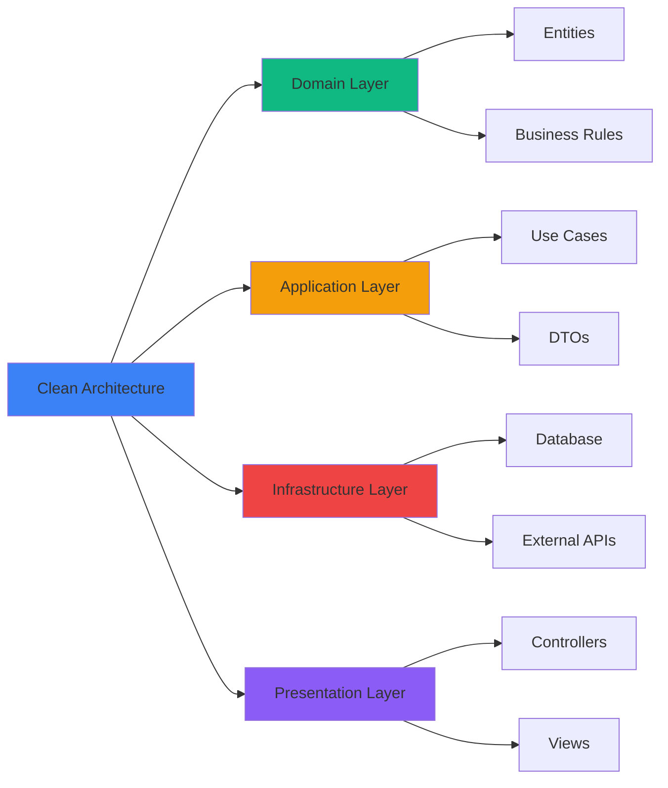

# <div align="center">👨‍💻 André Rodrigo</div>

<div align="center">
  
[](https://git.io/typing-svg)

</div>

<div align="center">
  

  
</div>

---

## 🎯 Sobre Mí

```typescript
const andre: Developer = {
  nombre: "André Rodrigo",
  ubicacion: "Perú 🇵🇪",
  rol: "Full Stack Developer",
  mentalidad: ["Constancia", "Disciplina", "0 Conformidad"],
  caracteristicas: {
    aprendizaje: "Autodidacta",
    pasion: "Código & Lógica",
    adaptabilidad: "Rápida a cualquier tecnología",
  },
  idiomas: {
    espanol: "Nativo",
    ingles: "Intermedio"
  },
  objetivos2025: [
    "Dominar patrones avanzados de arquitectura",
    "Contribuir a proyectos open source",
    "Construir productos escalables"
  ]
};
```

---

## 🛠️ Stack Tecnológico

<div align="center">

### 💻 Frontend


### ⚙️ Backend


### 🗄️ Bases de Datos


### 🚀 DevOps & Tools


</div>

---

## 📊 Estadísticas de GitHub

<div align="center">
  
  
</div>

<div align="center">
  
</div>

<div align="center">
  
</div>

---

## 🏆 Trofeos de GitHub

<div align="center">
  
</div>

---

## 💼 Experiencia en Arquitectura



---

## 🌟 Principios de Desarrollo

<div align="center">

| Principio | Descripción |
|-----------|-------------|
| 🎯 **SOLID** | Diseño orientado a objetos robusto |
| 🏗️ **Clean Code** | Código legible y mantenible |
| 🔄 **DRY** | Don't Repeat Yourself |
| ⚡ **KISS** | Keep It Simple, Stupid |
| 🧪 **TDD** | Test Driven Development |
| 📦 **Modular** | Separación de responsabilidades |

</div>

---

## 📈 Actividad Reciente

<!--START_SECTION:activity-->
<!--END_SECTION:activity-->

---

## 🤝 Conectemos

<div align="center">

[](https://linkedin.com/in/TU_LINKEDIN)
[](https://tu-portfolio.com)
[](mailto:tu-email@gmail.com)
[](https://twitter.com/TU_TWITTER)

</div>

---

<div align="center">
  
### 💭 Frase Favorita

*"El código es poesía en movimiento. Cada línea cuenta una historia, cada función resuelve un problema."*

---

### ⚡ Fun Fact

> 🚀 Mi superpoder: Convertir café en código limpio y escalable
> 
> 🎯 Mi misión: Resolver problemas complejos con soluciones elegantes
> 
> 🔥 Mi motor: La constancia y la disciplina inquebrantable

---


</div>

---

<div align="center">
  
**⭐ Si te gustó mi perfil, no olvides dar una estrella a mis repositorios ⭐**


</div>
